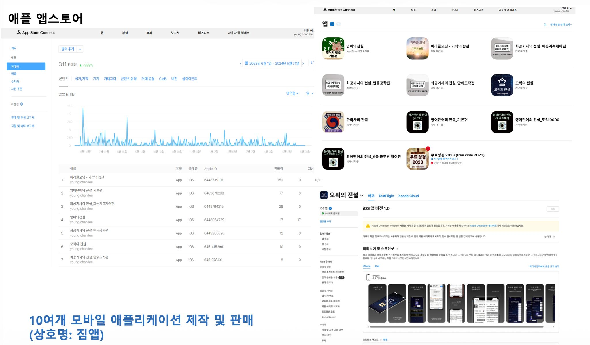
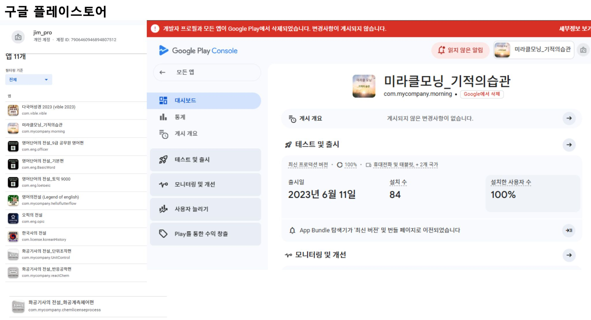

# 👋 JimProKing

**Python Developer | Crypto & Finance Tools | Web Security Education | Mobile Apps**

> 복잡한 시스템을 만들며 실전 도구와 교육용 플랫폼을 구축하는 개발자입니다.

## About Me

- **Elliott Wave 기반 트레이딩 도구** 제작: 주식 및 크립토 상위 종목 분석 스캐너 (Binance, 한국 주식)
- **XRPL / XRP 온체인 대시보드** 구축: 실시간 차트, 프리미엄, 부자 순위 등 종합 데이터 시각화
- **웹 해킹 교육 플랫폼**: 한국어 웹 해킹 책 기반의 취약 실습 사이트 (VulnBoard 시리즈)
- **실전 웹 애플리케이션**: 세금계산서 시스템, 상품 데모 등 Flask 기반 웹 앱 개발
- **모바일 앱 개발 (2022~2023)**: Flutter로 교육용 앱 10여 개 제작·배포 (App Store / Google Play, 상호명 짐앱)

## 🛠️ Skills

| Category          | Technologies                                      |
|-------------------|---------------------------------------------------|
| **Languages**     | Python, HTML/CSS/JS, Dart (Flutter 기초)     |
| **Backend**       | FastAPI, Flask, Django, Spring (work)             |
| **Data & Crypto** | pandas, numpy, FinanceDataReader, XRPL, Binance API |
| **Web Security**  | SQL Injection, XSS, IDOR, Burp Suite, Vuln labs   |
| **Tools**         | GitHub Actions, Railway, SQLite, Tailwind         |
| **Other**         | Data Visualization, Web Crawling, OCR             |

## 🚀 Featured Projects

### 📈 Crypto & Finance Tools

- **[Elliott Wave Scanner](https://github.com/JimProKing/elliott-wave-scanner)**  
  Binance USDT 고거래량 상위 코인 엘리어트 파동 스캐너. GitHub Actions로 4시간마다 자동 분석 → 공개 웹 뷰어 배포.  
  [Live Demo](https://elliott-focused-viewer-production.up.railway.app/)

- **[XRP On-Chain Dashboard](https://github.com/JimProKing/xrp-dashboard)**  
  XRPL 온체인 데이터, 거래소 거래량, 김치 프리미엄, 실시간 차트를 한 데서 보여주는 대시보드.  
  [Live Demo](https://web-production-7a41a.up.railway.app/)

- **[Elliott Wave Stock Recommender](https://github.com/JimProKing/elliott-wave-stock-recommender)**  
  한국 주식 고거래량 종목 대상 엘리어트 파동 기반 상승 가능성 분석 도구. 귀여운 펫 사진이 있는 안정 플러스키 웹 UI.

### 🔨 Web Security Education Labs

- **[VulnBoard + webhacking-bible-lab](https://github.com/JimProKing/VulnBoard)**  
  한국어 웹 해킹 책(크리해킹티브) 기반 의도적으로 취약한 실습 웹사이트. SQL Injection, XSS, IDOR, Command Injection 등 실제 공격 시나리오 제공. 
  구조화된 문제집 + 푸이 및 해결 설명 포함. Burp Suite 실습용.  
  [Live Demo](https://web-production-debfb.up.railway.app/)

- **[SQL Injection Lab](https://github.com/JimProKing/sql-injection-lab)**  
  Python(Flask) 와 JSP로 만든 SQLi 교육용 랩. 취약/안전 버전 비교 가능.

### 🌐 Practical Web Apps

- **[tax-invoice-web](https://github.com/JimProKing/tax-invoice-web)** — Flask 기반 한국형 세금계산서 작성/발행/인쇄 웹 앱
- **[pinkmiya](https://github.com/JimProKing/pinkmiya)** — 플라스크 + Tailwind 기반 귀여운 반려동물 쇼핑몰 데모

### 📱 Mobile App Development (2022~2023)

2022~2023년에 **Flutter 기반 모바일 앱 10여 개**를 직접 제작·배포·판매했습니다. (상호명: **짐앱**)  
App Store · Google Play에 교육/라이선스 시험 대비 앱을 출시했습니다.

- 영어 학습·토익·오픽, 한국사, 화학기사(필기/실기/학급), 미라클모닝 등 교육 앱 시리즈
- **App Store Connect** 판매 및 **Google Play Console** 배포·운영 경험

  
  

### Fundamentals

- **[python-data-structures](https://github.com/JimProKing/python-data-structures)** — 대학 과정 중심 Python 자료구조 구현 연습
- **[xrpl_examples](https://github.com/JimProKing/xrpl_examples)** — XRPL(XRP Ledger) 초보자를 위한 Python 예제 모음

## 📈 Journey

**2023~2025** — 기초 다지기
- Python (Django, Flask, FastAPI), Java(Spring), Flutter 기반 앱 개발
- 데이터 시각화, 크롤링, OCR 등 연습 프로젝트

**2025~2026** — 전문 도구 개발 기
- **파이낸스 / XRPL** 기반 크립토 & 파이낸스 도구 개발 (Elliott Wave, XRP Dashboard)
- **웹 해킹 교육 플랫폼** 제작 (VulnBoard 시리즈)
- 실전 비즈니스 웹 앱 (세금계산서 등)

## 📊 GitHub Stats

## 📬 Contact

- **Email**: caramel2516@naver.com
- **KakaoTalk**: caramel112

---

프로젝트 또는 협업 관련 이야기 환영합니다. 언제든 연락 주세요!