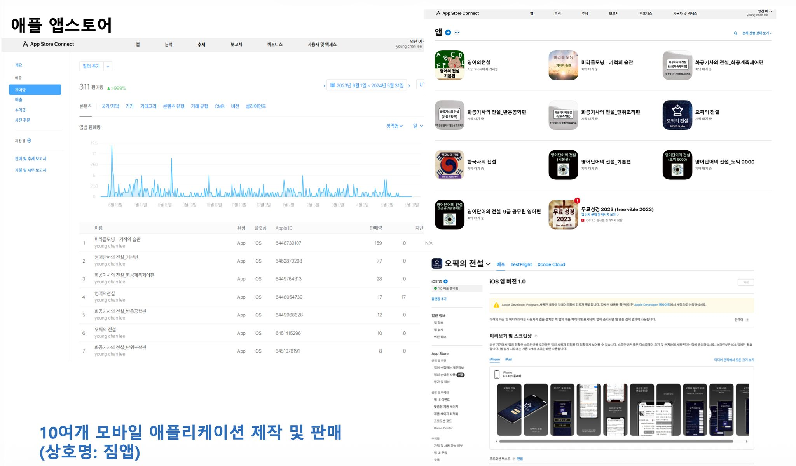
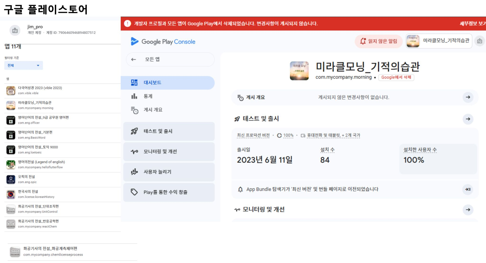

# JimProKing · 이영찬

**Web Security · Public IT · Builder**

> 앱 배포 경험 · 공공 전산 운영 · 웹/API 보안 학습

모바일 앱을 출시·운영했고, 현재 **국가직 공무원**으로 전산 업무를 하며 웹·API 보안을 공부하고 있습니다.  
화학공학 → 공정 엔지니어 → 1인 앱 사업 → 국가직 전산.

---

## Now

| | |
|--|--|
| **Role** | 국가직 공무원 (전산) |
| **Focus** | 웹/API 해킹 실습, PortSwigger, 취약점 분석, 방어 관점 학습 |
| **Cert** | 정보보안기사 응시 완료 (결과 대기) · 정보처리기사 등 |
| **Stack (work)** | Java · Spring · JSP · WebSquare · DB2 · XML 메시지 · 형상관리·테스트·유지보수 |
| **Stack (build)** | Python · Flask/FastAPI · JS · Flutter(Dart) · GitHub Actions |

---

## About

- **공공 전산** — 대국민 서비스 요구분석·설계·유지보수·테스트
- **웹·API 보안** — 취약 랩, PortSwigger write-up, API 해킹 학습, 방어 실험
- **1인 제품** — Flutter 교육용 앱 10여 개 App Store / Google Play 출시 (짐앱, 2022–2023)
- **배경** — 화학공학 · 공정기술직 · 데이터·자동화 경험
- **사이드** — 파이낸스/온체인 대시보드·스캐너

---

## Featured · Security first

### Labs & write-ups

- **[api-hacking-notes](https://github.com/JimProKing/api-hacking-notes)** — 《API 해킹의 모든 것》 기반 학습 노트 (REST/GraphQL, BOLA, JWT, 퀴즈)  
  [Live](https://api-hacking-notes-production.up.railway.app/)
- **[VulnBoard](https://github.com/JimProKing/VulnBoard)** · **[webhacking-bible-lab](https://github.com/JimProKing/webhacking-bible-lab)** — 웹 해킹 실습 보드 (SQLi, XSS, IDOR 등)  
  [Live](https://web-production-debfb.up.railway.app/)
- **[sql-injection-lab](https://github.com/JimProKing/sql-injection-lab)** — Flask/JSP SQLi 교육 랩 (취약 vs 안전)
- **[Unprotected-Admin-Functionality-simple](https://github.com/JimProKing/Unprotected-Admin-Functionality-simple)** · **[File-Path-Traversal-simple](https://github.com/JimProKing/File-Path-Traversal-simple)** — PortSwigger Academy 풀이
- **[optical-qr-transfer](https://github.com/JimProKing/optical-qr-transfer)** — 화면 QR + 카메라 광학 파일 전송
- **[aegis-cortex](https://github.com/JimProKing/aegis-cortex)** — 로그 상관·IOC·ATT&CK 매핑 실험
- **[aegis-protocol](https://github.com/JimProKing/aegis-protocol)** — 브라우저 정보보안 교육 게임
- **[info-sec-memo](https://github.com/JimProKing/info-sec-memo)** · **[security-exam-study](https://github.com/JimProKing/security-exam-study)** — 정보보안기사 학습 도구
- **[dreamhack](https://github.com/JimProKing/dreamhack)** — Dreamhack 강의·워게임 노트

### Product & systems

- **Flutter 앱 10+** (짐앱) — 토익·오픽·한국사·기사 시험 교육 앱, 스토어 배포
- Work: 국가직 전산 — Spring, 대량 메시지·형상·품질 프로세스

  
  

### Also building

- **[elliott-wave-scanner](https://github.com/JimProKing/elliott-wave-scanner)** — Binance 고거래량 엘리어트 스캐너 + Actions  
  [Live](https://elliott-focused-viewer-production.up.railway.app/)
- **[xrp-dashboard](https://github.com/JimProKing/xrp-dashboard)** — XRPL 온체인·거래량·프리미엄 대시보드  
  [Live](https://web-production-7a41a.up.railway.app/)
- **[longshort-han-nune](https://github.com/JimProKing/longshort-han-nune)** — 롱/숏 비율·지지·진입 뷰어

---

## Skills

| Area | |
|------|--|
| **Security** | Web/API vulns (SQLi, XSS, IDOR, access control, path traversal), Burp, lab design |
| **Languages** | Python, Java, JavaScript, Dart (Flutter), SQL |
| **Backend / work** | Spring, JSP, WebSquare, FastAPI, Flask, Django, DB2 / SQLite |
| **Ship** | App Store / Play 배포, GitHub Actions, Railway |
| **Other** | pandas, 크롤링, 데이터 시각화 |

---

## Journey

| Period | |
|--------|--|
| **~2021** | 화학공학 전공 |
| **2021–2022** | 대기업 공정기술직 |
| **2022–2023** | 1인 사업(짐앱) — Flutter 앱 10+ 출시 |
| **2024.11 –** | 국가직 공무원 전산 |
| **2025–2026** | 웹해킹 랩, PortSwigger, API 해킹, 정보보안기사 응시 |

---

## Contact

- **Email:** caramel2516@naver.com  
- **KakaoTalk:** caramel112  
- **GitHub:** [JimProKing](https://github.com/JimProKing)

*(업무상 비공개 시스템·미공개 취약점 상세는 공유하지 않습니다.)*

---

 

# JimProKing (English)

**Web Security · Public IT · Builder**

> App shipping · Public IT operations · Web/API security practice

I shipped 10+ mobile apps and currently work as a **national government civil servant (IT)** while studying web/API security.  
Path: Chemical Engineering → process engineer → indie apps → public-sector IT.

### Now

- **Role:** National government civil servant (IT)
- **Focus:** Web/API security practice, PortSwigger, vulnerability analysis
- **Cert:** Information Security Engineer exam taken (awaiting result)
- **Work stack:** Java, Spring, JSP, WebSquare, DB2, XML messaging, SCM / test / maintenance
- **Build stack:** Python, Flask/FastAPI, JS, Flutter, GitHub Actions

### Highlights

- Public IT: requirements, design, maintenance, testing on citizen-facing services
- Security labs: VulnBoard, API hacking notes, PortSwigger write-ups, defensive experiments ([aegis-cortex](https://github.com/JimProKing/aegis-cortex))
- **10+ Flutter apps** on App Store / Google Play (JimApp, 2022–2023)
- Background: ChemEng, plant process role

### Featured repos

Security: [api-hacking-notes](https://github.com/JimProKing/api-hacking-notes) · [VulnBoard](https://github.com/JimProKing/VulnBoard) · [webhacking-bible-lab](https://github.com/JimProKing/webhacking-bible-lab) · PortSwigger practice · [optical-qr-transfer](https://github.com/JimProKing/optical-qr-transfer) · [aegis-cortex](https://github.com/JimProKing/aegis-cortex) · [dreamhack](https://github.com/JimProKing/dreamhack)  
Ship: Flutter portfolio (images above)  
Side: [elliott-wave-scanner](https://github.com/JimProKing/elliott-wave-scanner) · [xrp-dashboard](https://github.com/JimProKing/xrp-dashboard)

### Journey

ChemEng → plant engineer (2021–22) → indie apps (2022–23) → national civil servant, IT (2024.11–) → security focus (2025–26).

### Contact

- **Email:** caramel2516@naver.com  
- **KakaoTalk:** caramel112  

*(No confidential systems or undisclosed vulnerability details.)*

---

README updated: 2026-08 · Public-sector affiliation stated only as national civil servant (no agency name).
